# Yummy-Meals

**A food ordering app.**

 
Star⭐ the repo if you like what you see😉.

<h3> Screenshots</h2> 

&nbsp;                    |  &nbsp;
:-------------------------|:-------------------------
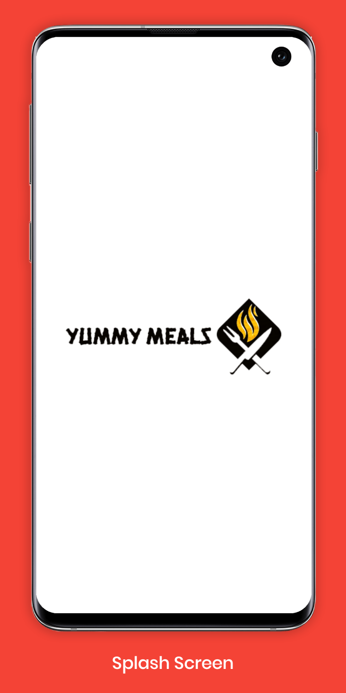  |  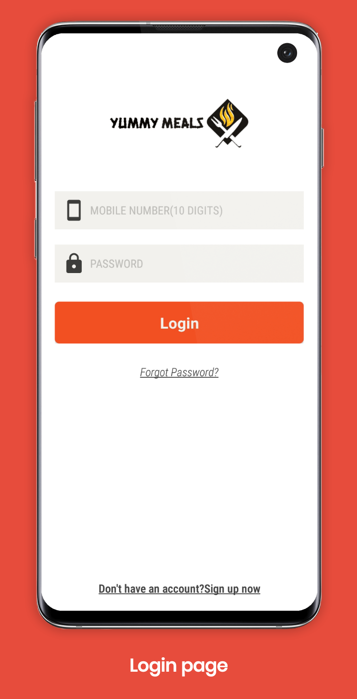
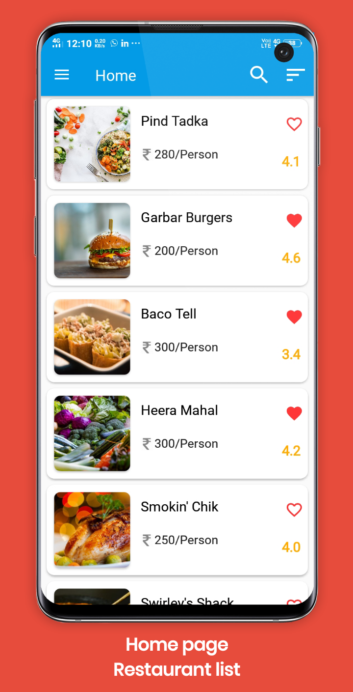  |  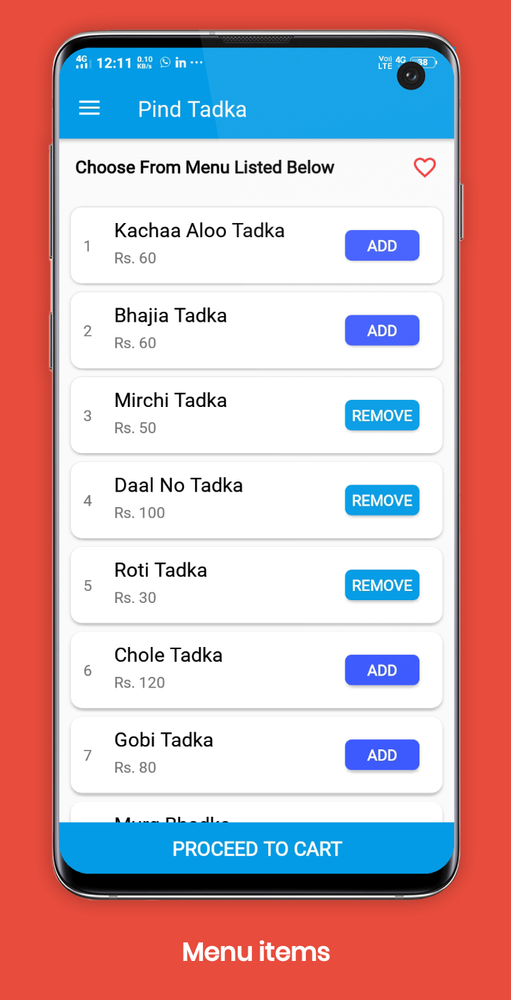
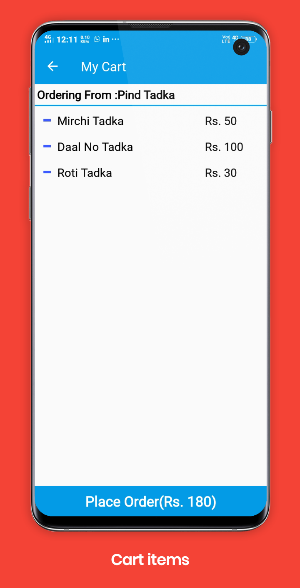  |  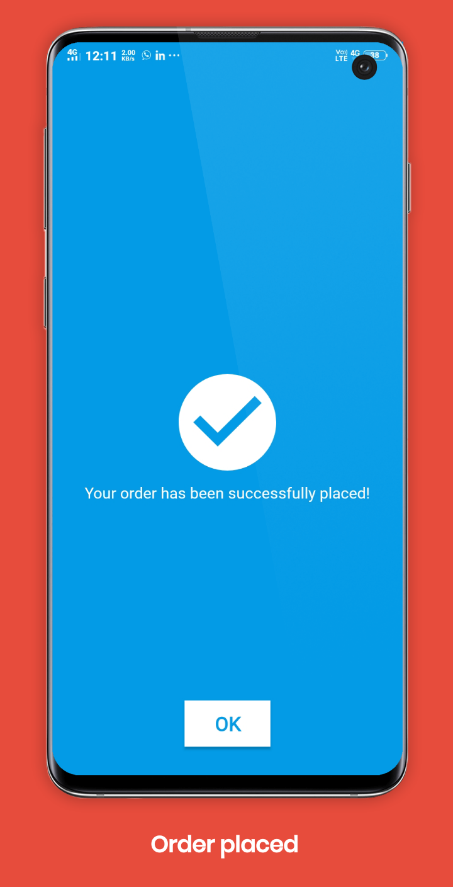
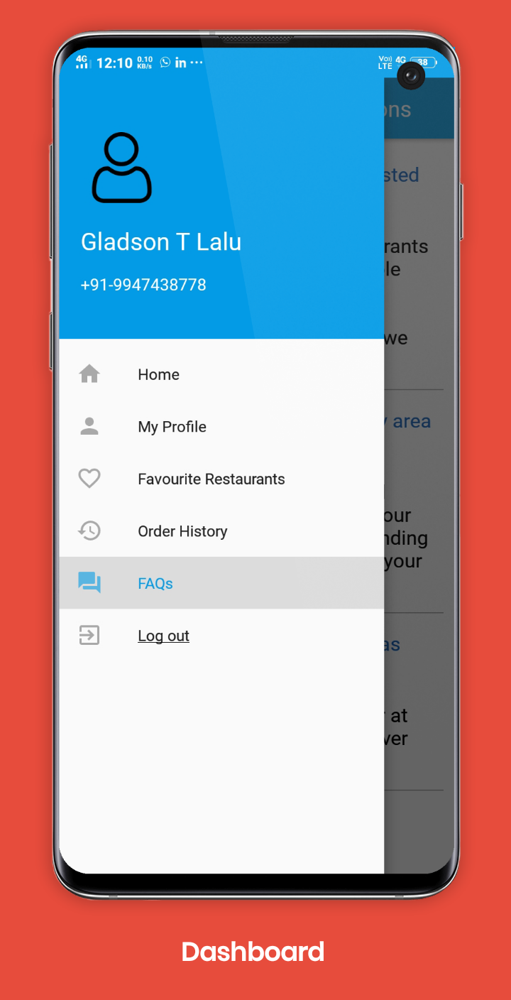  |  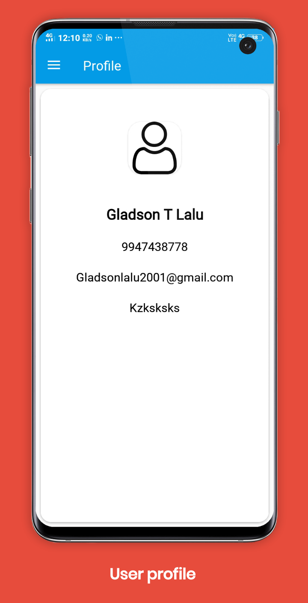
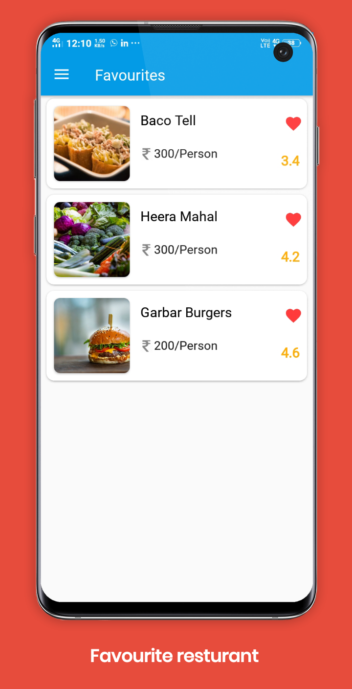  |  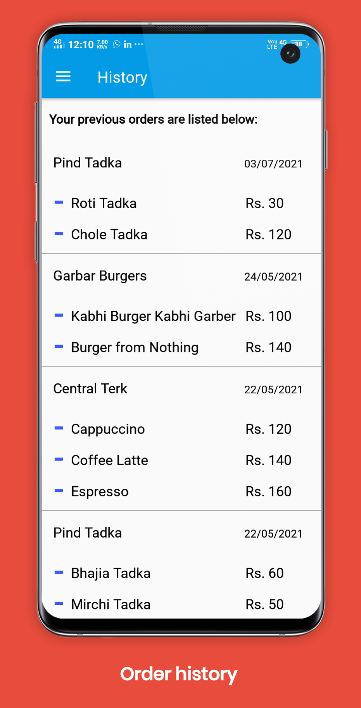
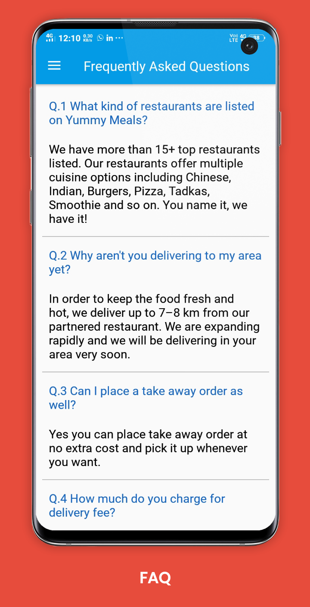  |  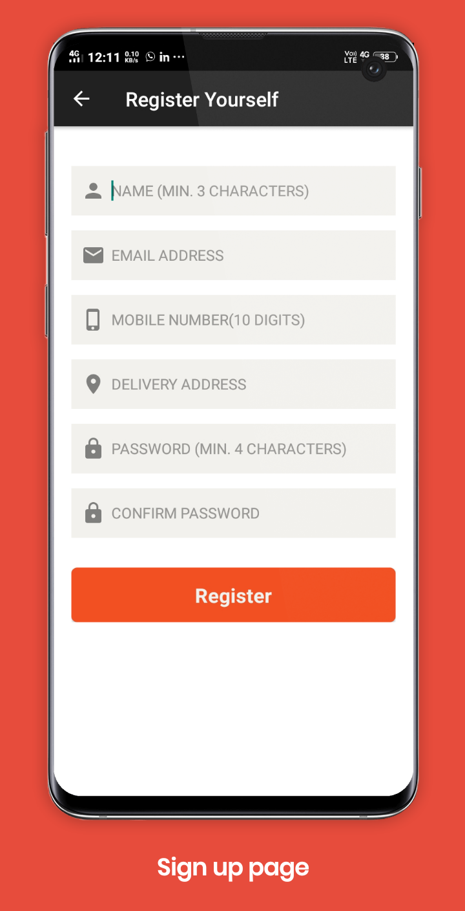
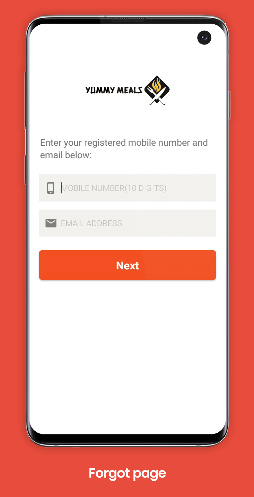  |  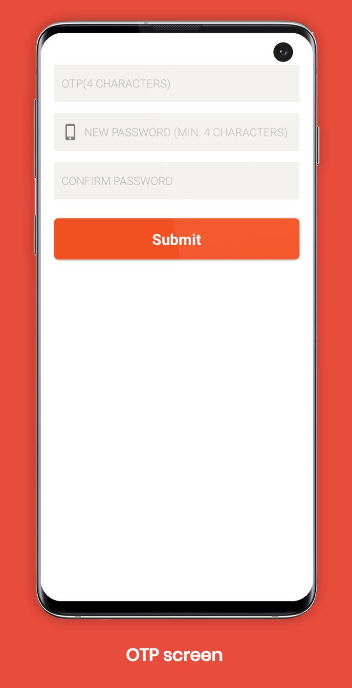

## Download 
Download the APK [here](https://github.com/Gladson-Lalu/Yummy-Meals/raw/main/APK/Yummy_Meals.apk)

## Getting Started
1. Install Android Studio, if you don't already have it.
2. Download the sample.
3. Import the sample into Android Studio.
4. Build and run the sample.
